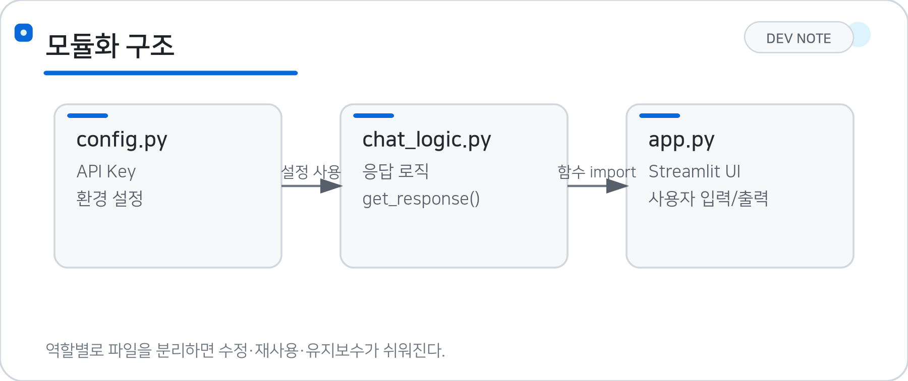
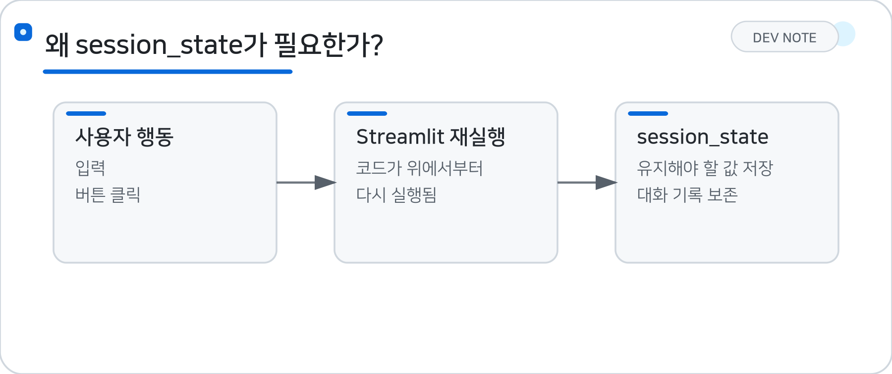
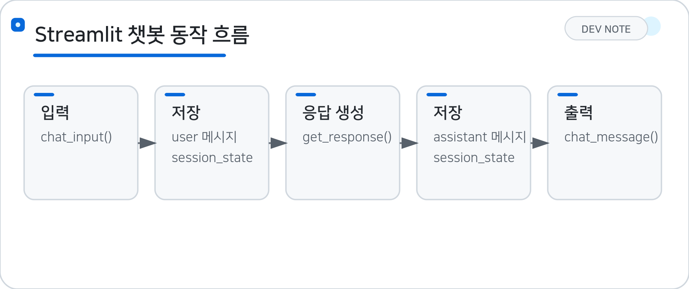

# 08/14 (금) · 7일차 — Streamlit 챗봇과 모듈화

## 1. 모듈화 (Modularization)

**모듈화**는 하나의 파일에 모든 코드를 작성하지 않고, **기능과 역할에 따라 여러 파일로 나누어 관리하는 것**이다.

> **핵심:** 모듈화란 기능과 역할에 따라 코드를 여러 파일로 나누어 관리하는 것이다.



필요한 기능은 `import`를 통해 다른 파일에서 가져와 사용한다.

```text
chatbot_app/
├── app.py          # 화면(UI)
├── chat_logic.py   # 챗봇 응답 로직
└── config.py       # 설정값
```

> 코드가 길어질수록 역할별로 분리하면 수정과 유지보수가 쉬워진다.

### 1.1 `config.py` — 설정 관리

API Key나 환경 설정처럼 **여러 곳에서 사용할 설정값을 관리**한다.

```python
# config.py

API_KEY = "..."
```

### 1.2 `chat_logic.py` — 기능/로직

사용자의 입력을 받아 **챗봇의 답변을 만드는 기능**을 담당한다.

```python
# chat_logic.py

def get_response(user_input: str) -> str:
    return f"'{user_input}'에 대한 답변입니다."
```

### 1.3 `app.py` — 화면 구성

Streamlit을 이용해 사용자가 실제로 보는 **화면(UI)**을 구성한다.

다른 파일의 함수는 `import`해서 사용한다.

```python
from chat_logic import get_response
```

즉,

```text
app.py
  ↓ 함수 호출
chat_logic.py
  ↓
답변 반환
```

처럼 파일끼리 역할을 나눠 사용할 수 있다.

### 1.4 `st.session_state`

Streamlit은 사용자가 입력하거나 버튼을 누를 때 **코드가 위에서부터 다시 실행**될 수 있다.

따라서 계속 기억해야 하는 값은 `st.session_state`에 저장한다.

```python
if "messages" not in st.session_state:
    st.session_state.messages = []
```

챗봇에서는 이전 대화 내용을 저장하는 용도로 사용할 수 있다.

```python
st.session_state.messages.append(
    {"role": "user", "content": user_input}
)
```

> `session_state` = Streamlit에서 **계속 기억해야 하는 데이터를 저장하는 공간**



---

## 2. Streamlit 챗봇 기능

### 2.1 `st.chat_input()`

사용자가 메시지를 입력하는 입력창이다.

```python
user_input = st.chat_input("메시지를 입력하세요")
```

### 2.2 `st.chat_message()`

사용자와 챗봇의 메시지를 화면에 표시한다.

```python
st.chat_message("user").write("안녕하세요")
st.chat_message("assistant").write("반갑습니다!")
```

* `"user"` → 사용자 메시지
* `"assistant"` → 챗봇 메시지

### 2.3 챗봇 동작 흐름



```text
사용자 메시지 입력
        ↓
st.chat_input()
        ↓
session_state에 사용자 메시지 저장
        ↓
get_response() 호출
        ↓
챗봇 답변 생성
        ↓
session_state에 답변 저장
        ↓
st.chat_message()로 화면 출력
```

### 2.4 UI와 로직을 분리하는 이유

`app.py`와 `chat_logic.py`를 분리하면 각각 필요한 부분만 수정할 수 있다.

* 화면 디자인 변경 → `app.py` 수정
* 챗봇 답변 방식 변경 → `chat_logic.py` 수정
* 설정값 변경 → `config.py` 수정

> **모듈화의 목적 = 코드의 역할을 분리해서 재사용과 유지보수를 쉽게 만드는 것**

---

## 3. 전체 흐름

```text
모듈화로 파일 역할 분리 (config.py / chat_logic.py / app.py)
  ↓
st.session_state로 대화 데이터 유지
  ↓
st.chat_input()으로 사용자 메시지 입력
  ↓
chat_logic.py의 get_response() 호출해 답변 생성
  ↓
st.chat_message()로 화면에 출력
```

---

## 🟦 핵심 정리

### 💡 주요 개념

| 개념 | 의미 |
| --- | --- |
| 모듈화 | 기능별로 코드를 여러 파일로 분리 |
| `import` | 다른 파일의 기능을 가져와 사용 |
| `app.py` | Streamlit 화면(UI) 담당 |
| `chat_logic.py` | 챗봇의 기능과 응답 로직 담당 |
| `config.py` | API Key 등의 설정값 관리 |
| `st.session_state` | 다시 실행되어도 유지해야 할 데이터 저장 |
| `st.chat_input()` | 사용자 채팅 입력 |
| `st.chat_message()` | 사용자/챗봇 메시지 출력 |
| UI와 로직 분리 | 수정·재사용·유지보수를 쉽게 함 |

### 💻 주요 코드

| 코드 | 의미 |
| --- | --- |
| `st.session_state.messages = []` | 대화 기록을 저장할 리스트 초기화 |
| `st.session_state.messages.append(...)` | 새 메시지를 세션에 저장 |
| `st.chat_input("메시지를 입력하세요")` | 사용자 입력창 생성 |
| `st.chat_message("user").write(...)` | 사용자 메시지 화면 출력 |
| `st.chat_message("assistant").write(...)` | 챗봇 메시지 화면 출력 |
| `from chat_logic import get_response` | 다른 파일의 함수를 가져와 사용 |
| `def get_response(user_input: str) -> str:` | 챗봇 응답을 생성하는 함수 정의 |

### ⭐ 오늘의 핵심

- **핵심 1:** 코드는 기능별로 config.py, chat_logic.py, app.py로 나누어 모듈화하면 유지보수가 쉬워진다.
- **핵심 2:** Streamlit은 입력마다 코드가 다시 실행되므로, 계속 유지해야 할 데이터는 st.session_state에 저장해야 한다.
- **핵심 3:** st.chat_input()과 st.chat_message()를 조합해 사용자 입력과 챗봇 응답을 주고받는 채팅 UI를 구성할 수 있다.

### 🔖 복습할 내용

- [ ] st.session_state의 동작 원리와 재실행 시에도 값이 유지되는 이유
- [ ] chat_logic.py와 app.py 간 함수 import 구조
- [ ] 챗봇 동작 흐름(입력 → 저장 → 응답 생성 → 저장 → 출력) 전체 과정
