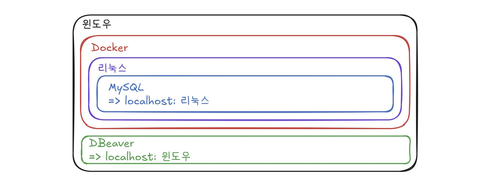
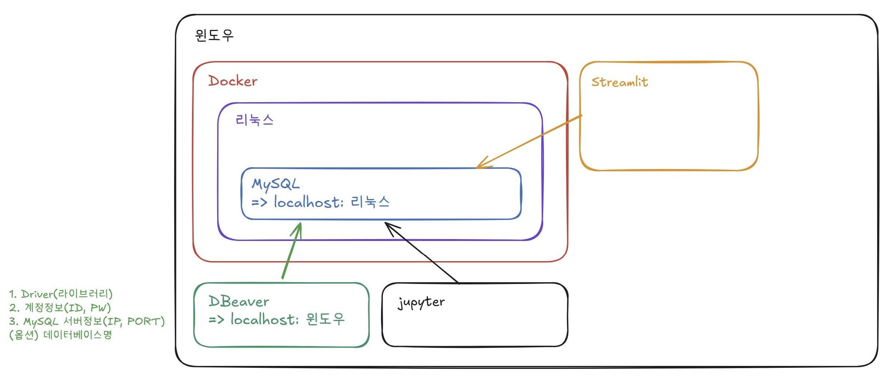

# 08/20 · 10일차 --- SQL 집계·서브쿼리와 Python MySQL 연동

## 🔁 이전 내용 복습

### 기본키·테이블 관계·JOIN

이전 수업에서 기본키와 외래키로 테이블 관계를 만들고 `JOIN`으로 여러 테이블을 연결했다. 오늘은 `classicmodels` 데이터베이스에서 JOIN 결과를 집계하고 서브쿼리로 단계적으로 확장했다.

``` sql
SELECT ...
FROM table1 t1
JOIN table2 t2 ON t1.key = t2.key;
```

> **핵심:** 공통 키로 테이블을 연결한 뒤 그룹별 집계와 서브쿼리를 이용해 더 복잡한 질문에 답한다.

------------------------------------------------------------------------

## 1. MySQL 컨테이너에 터미널로 접속

Docker Desktop의 MySQL 컨테이너에서 `Exec` 탭을 열면 컨테이너 내부 명령을 직접 실행할 수 있다.

``` bash
mysql -u root -p
```

- `-u root` → `root` 사용자로 접속
- `-p` → 비밀번호 입력 방식으로 접속

``` sql
USE mysql;

SELECT Host, User
FROM user;
```

`mysql` 시스템 데이터베이스를 선택하고 계정별 접속 위치와 사용자 이름을 조회한다.

![[04 실습파일/week03/day10/스크린샷 2026-08-20 100410.png]]

------------------------------------------------------------------------

## 2. 기본 조회와 결과 제한

`classicmodels` 예제 데이터베이스를 선택하고 고객 데이터를 조건·정렬·개수 제한과 함께 조회했다.

``` sql
USE classicmodels;
SHOW TABLES;

SELECT
    customerName,
    phone,
    country,
    creditLimit
FROM customers
WHERE country = 'USA'
ORDER BY creditLimit DESC
LIMIT 10;
```

| 절 | 역할 |
| --- | --- |
| `SELECT` | 조회할 컬럼 선택 |
| `FROM` | 조회할 테이블 선택 |
| `WHERE` | 조건에 맞는 행 선택 |
| `ORDER BY` | 결과 정렬 |
| `DESC` | 내림차순 |
| `ASC` | 오름차순이며 생략 시 기본값 |
| `LIMIT 10` | 앞에서 10행만 조회 |

------------------------------------------------------------------------

## 3. 그룹별 집계

### 3.1 고객별 주문 횟수

``` sql
SELECT
    COUNT(orderNumber) AS cnt,
    customerNumber
FROM orders
GROUP BY customerNumber
ORDER BY cnt DESC
LIMIT 3;
```

- `COUNT(orderNumber)` → 고객별 주문 개수 계산
- `GROUP BY customerNumber` → 같은 고객 번호의 행을 하나의 그룹으로 묶음
- `AS cnt` → 집계 결과 컬럼에 별칭 지정
- `ORDER BY cnt DESC` → 주문 횟수가 많은 순서
- `LIMIT 3` → 상위 3명만 선택

### 3.2 고객별 주문 총액

먼저 주문 상세의 수량과 단가를 곱해 각 상품 주문 금액을 구한다.

``` sql
SELECT
    quantityOrdered * priceEach AS totalPrice,
    orderNumber
FROM orderdetails
ORDER BY totalPrice DESC;
```

그 결과를 주문 테이블과 연결하고 고객별로 합산한다.

``` sql
SELECT
    o.customerNumber,
    SUM(od.totalPrice) AS totalPriceByCustomer
FROM orders o
JOIN (
    SELECT
        quantityOrdered * priceEach AS totalPrice,
        orderNumber
    FROM orderdetails
) od ON o.orderNumber = od.orderNumber
GROUP BY o.customerNumber
ORDER BY totalPriceByCustomer DESC;
```

- `quantityOrdered * priceEach` → 주문 상품별 금액
- `SUM()` → 같은 고객 그룹의 주문 금액 합계
- 주문이 있는 고객만 JOIN 결과에 포함

------------------------------------------------------------------------

## 4. 서브쿼리와 JOIN

서브쿼리는 SQL 문 안에 들어가는 또 다른 SQL 문이다. 먼저 필요한 결과를 만든 뒤 그 결과를 하나의 테이블처럼 JOIN할 수 있다.

### 4.1 주문 횟수 상위 고객 정보

``` sql
SELECT
    c.customerName,
    c.phone,
    c.country,
    c.creditLimit,
    top_orders.cnt
FROM customers c
JOIN (
    SELECT
        COUNT(orderNumber) AS cnt,
        customerNumber
    FROM orders
    GROUP BY customerNumber
    ORDER BY cnt DESC
    LIMIT 3
) top_orders
    ON c.customerNumber = top_orders.customerNumber;
```

### 4.2 총 구매액 상위 3명

``` sql
SELECT
    c.customerName,
    c.phone,
    c.country,
    c.creditLimit,
    totals.totalPriceByCustomer
FROM customers c
JOIN (
    SELECT
        o.customerNumber,
        SUM(od.totalPrice) AS totalPriceByCustomer
    FROM orders o
    JOIN (
        SELECT
            quantityOrdered * priceEach AS totalPrice,
            orderNumber
        FROM orderdetails
    ) od ON o.orderNumber = od.orderNumber
    GROUP BY o.customerNumber
    ORDER BY totalPriceByCustomer DESC
    LIMIT 3
) totals ON c.customerNumber = totals.customerNumber;
```

> **오류 수정:** 원본 일부 최종 쿼리는 고객 이름·전화번호 등을 `t2`에서 조회했지만 해당 서브쿼리에는 그 컬럼이 없다. 실습 SQL과 실행 화면처럼 외부 `customers` 테이블 별칭의 컬럼을 조회해야 한다.

실행 결과:

| customerName | phone | country | creditLimit | totalPriceByCustomer |
| --- | --- | --- | ---: | ---: |
| Euro+ Shopping Channel | (91) 555 94 44 | Spain | 227600.00 | 820689.54 |
| Mini Gifts Distributors Ltd. | 4155551450 | USA | 210500.00 | 591827.34 |
| Australian Collectors, Co. | 03 9520 4555 | Australia | 117300.00 | 180585.07 |

![[04 실습파일/week03/day10/스크린샷 2026-08-20 122912.png]]

복잡한 SQL은 작은 조회를 먼저 실행해 결과를 검증한 뒤 서브쿼리와 JOIN으로 감싸는 방식으로 확장한다.

------------------------------------------------------------------------

## 5. Python 프로젝트 환경 준비

``` text
pyproject.toml 있음 → uv sync
새 프로젝트 시작 → uv init
```

- `uv sync` → 기존 `pyproject.toml`의 설정에 맞게 환경과 의존성 동기화
- `uv init` → 새로운 Python 프로젝트 설정 생성

------------------------------------------------------------------------

## 6. PyMySQL로 MySQL 연결

### 6.1 MySQL 실행 및 연결 구조



Windows에서 Docker를 실행하고, Docker 컨테이너 내부의 Linux 환경에서 MySQL 서버가 실행된다. DBeaver는 Windows에서 실행되며 Docker 내부의 MySQL 서버에 접속한다.



MySQL 서버에는 DBeaver뿐만 아니라 Jupyter, Streamlit 등의 프로그램에서도 접속할 수 있다.

Python에서 MySQL에 연결하려면 드라이버, 계정, 서버, 데이터베이스 정보가 필요하다.

``` python
import pymysql

DB_CONFIG = {
    "host": "localhost",
    "port": 3306,
    "user": "root",
    "password": "root1234",
    "database": "classicmodels",
}
```

> **오류 수정:** 원본 첫 예제에는 `"password"` 항목 뒤의 쉼표가 빠져 있었다. 딕셔너리 항목을 구분하도록 쉼표를 추가했다.

### 6.2 Connection과 Cursor

``` python
with pymysql.connect(**DB_CONFIG) as conn:
    with conn.cursor() as cur:
        cur.execute("SHOW TABLES;")
        results = cur.fetchall()
```

- `pymysql.connect()` → MySQL 서버와 연결하는 Connection 생성
- `**DB_CONFIG` → 딕셔너리의 키와 값을 키워드 인자로 전달
- `conn.cursor()` → SQL을 전달하고 결과를 받는 Cursor 생성
- `execute()` → SQL 실행
- `fetchall()` → 조회 결과 전체 가져오기
- `with` → 블록이 끝날 때 Connection과 Cursor 자원 정리

조회된 테이블:

``` text
customers, employees, offices, orderdetails,
orders, payments, productlines, products
```

------------------------------------------------------------------------

## 7. `.env`와 환경 변수

데이터베이스 계정과 비밀번호를 코드에 직접 작성하면 저장소에 함께 올라갈 위험이 있다. 실습에서는 `.env`에 값을 분리하고 `python-dotenv`로 환경 변수에 등록했다.

``` python
from dotenv import load_dotenv

load_dotenv()
```

``` python
import os

DB_CONFIG = {
    "host": os.getenv("host"),
    "port": int(os.getenv("port")),
    "user": os.getenv("user"),
    "password": os.getenv("password"),
    "database": os.getenv("database"),
}
```

``` text
.env 파일
  ↓ load_dotenv()
환경 변수에 등록
  ↓ os.getenv()
Python 코드에서 값 사용
```

> **오류 수정:** `os`는 Windows 자체가 아니라 운영체제와 관련된 기능 및 환경 변수 접근을 제공하는 Python 표준 모듈이다.

`.env`를 새로 만들거나 수정한 뒤 기존 Notebook에 값이 반영되지 않으면 Kernel을 다시 시작한다.

------------------------------------------------------------------------

## 8. 싱글톤 MySQL 연결 클래스

실습에서는 한 번 만든 `MySQLDB` 객체를 재사용하도록 싱글톤 메타클래스를 적용했다.

``` python
import pymysql

class Singleton(type):
    _instances = {}

    def __call__(cls, *args, **kwargs):
        if cls not in cls._instances:
            cls._instances[cls] = super().__call__(*args, **kwargs)
        return cls._instances[cls]

class MySQLDB(metaclass=Singleton):
    def __init__(self, db_config: dict) -> None:
        self.conn = pymysql.connect(
            **db_config,
            charset="utf8mb4",
            cursorclass=pymysql.cursors.DictCursor,
        )

    def __call__(self, query: str):
        with self.conn.cursor() as cur:
            cur.execute(query=query)
            return cur.fetchall()
```

- `DictCursor` → 각 조회 행을 컬럼 이름이 있는 딕셔너리 형태로 반환
- `__call__()` → 인스턴스를 함수처럼 호출해 SQL 실행
- 싱글톤 → `MySQLDB(...)`를 다시 호출해도 기존 인스턴스 재사용

``` python
from connections import MySQLDB

mysqldb = MySQLDB(DB_CONFIG)
results = mysqldb("SELECT * FROM customers;")
```

Notebook에서는 조회 결과를 Pandas DataFrame으로 변환해 확인했다.

``` python
import pandas as pd

pd.DataFrame(results)
```

------------------------------------------------------------------------

## 전체 흐름

``` text
기본 SELECT에 WHERE·ORDER BY·LIMIT 적용
  ↓
COUNT·SUM과 GROUP BY로 고객별 집계
  ↓
작은 조회를 서브쿼리로 만들어 JOIN
  ↓
총 구매액 상위 고객 정보 조회
  ↓
uv로 Python 프로젝트 환경 준비
  ↓
.env에서 접속 정보를 환경 변수로 등록
  ↓
PyMySQL Connection·Cursor로 SQL 실행
  ↓
싱글톤 MySQLDB 객체로 연결과 조회 재사용
```

------------------------------------------------------------------------

## 🟦 핵심 정리

### 💡 주요 개념

| 개념 | 의미 |
| --- | --- |
| `GROUP BY` | 같은 기준값의 행을 그룹화 |
| 집계 함수 | 그룹의 개수·합계 등을 계산 |
| 서브쿼리 | SQL 문 안에 포함된 다른 SQL 문 |
| Connection | Python과 MySQL 서버의 연결 |
| Cursor | SQL 전달과 결과 수신을 담당하는 객체 |
| 환경 변수 | 코드 밖에서 접속 정보 같은 값을 제공하는 방식 |
| Singleton | 하나의 연결 객체를 만들어 재사용하는 패턴 |

### 💻 주요 코드

| 코드 | 의미 |
| --- | --- |
| `WHERE ... ORDER BY ... LIMIT` | 조건·정렬·개수 제한 조회 |
| `COUNT() / SUM()` | 개수 / 합계 집계 |
| `GROUP BY` | 집계 기준 그룹화 |
| `JOIN (서브쿼리) ... ON` | 중간 결과를 다른 테이블과 연결 |
| `pymysql.connect(**DB_CONFIG)` | MySQL Connection 생성 |
| `cur.execute() / cur.fetchall()` | SQL 실행 / 전체 결과 조회 |
| `load_dotenv() / os.getenv()` | `.env` 등록 / 환경 변수 읽기 |

### ⭐ 오늘의 핵심

- **단계적 SQL:** 작은 조회를 검증한 뒤 집계·서브쿼리·JOIN으로 확장한다.
- **그룹 집계:** `GROUP BY`와 `COUNT`, `SUM`으로 고객별 주문 횟수와 총액을 계산한다.
- **Python 연결:** PyMySQL의 Connection과 Cursor로 SQL을 실행하고 결과를 가져온다.
- **설정 분리:** 접속 정보는 `.env`로 코드와 분리하고 연결 객체는 싱글톤으로 재사용한다.

### 🔖 복습할 내용

- [ ] SELECT의 WHERE·ORDER BY·LIMIT 순서 연습하기
- [ ] GROUP BY와 집계 함수 조합하기
- [ ] 서브쿼리를 단계별로 분리해 실행하기
- [ ] Connection과 Cursor 역할 비교하기
- [ ] `.env` → `load_dotenv()` → `os.getenv()` 흐름 확인하기
