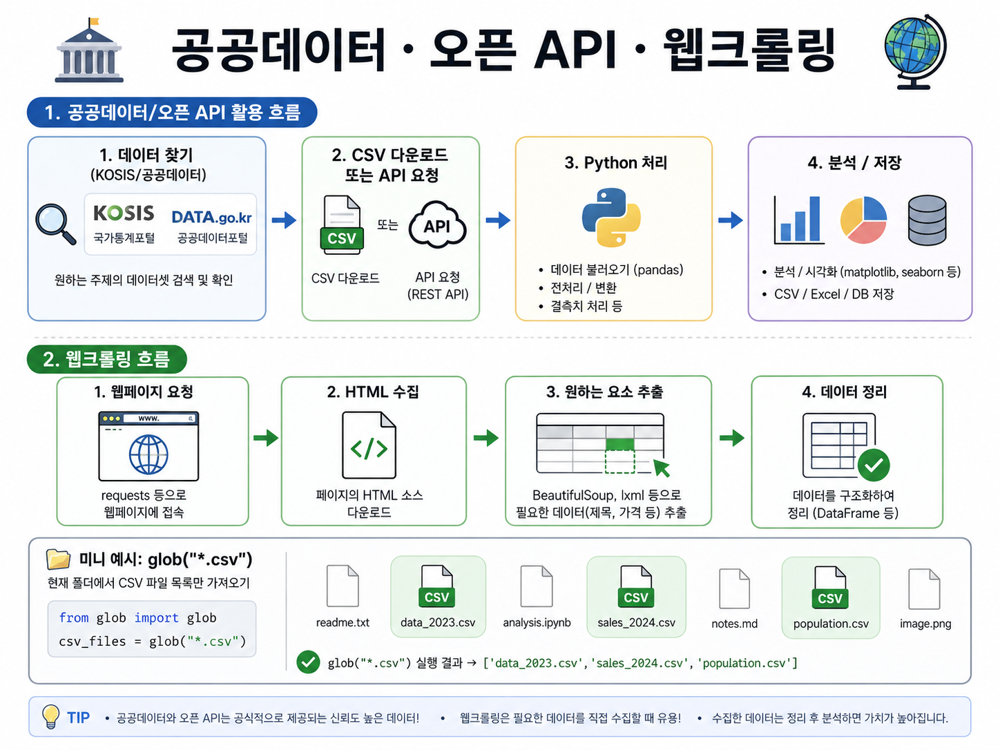

# 08/21 (금) · 11일차 — 공공데이터와 오픈 API, 웹크롤링

## 1. 국가통계포털에서 데이터 찾기

공공데이터를 활용할 때는 먼저 **국가통계포털에서 필요한 데이터를 검색**해서 찾는다.

필요한 데이터를 찾았다면 CSV 파일로 다운로드하여 사용할 수 있다.

CSV 파일을 불러올 때는 인코딩을 `utf-8` 기준으로 사용한다.

### 1.1 CSV 파일 찾기

전체 CSV 파일을 가리킬 때는 `*.csv`처럼 **와일드카드(`*`)**를 사용할 수 있다.

```text id="g2d3fn"
*.csv
```

의 의미는 **확장자가 `.csv`인 모든 파일**이다.

파이썬에서는 `glob`을 이용해서 특정 패턴에 해당하는 파일을 한 번에 찾을 수 있다.

```python id="t0bhsg"
import glob

csv_files = glob.glob("*.csv")
```

`glob.glob("*.csv")`를 실행하면 현재 폴더에 존재하는 모든 CSV 파일의 목록을 가져온다.

예를 들어 현재 폴더에 다음과 같은 파일이 있다면,

```text id="fngtkn"
data1.csv
data2.csv
user.csv
test.txt
```

`*.csv`에 해당하는 파일은 다음과 같다.

```text id="s7nmks"
data1.csv
data2.csv
user.csv
```

> **`*` = 여러 문자 또는 파일명을 대신할 수 있는 와일드카드**

---

## 2. 2차원 데이터

CSV 파일을 pandas로 불러오면 **행(row)과 열(column)로 구성된 2차원 데이터**로 다룰 수 있다.

```text id="pyy4mx"
        column
          ↓
      이름    나이    지역
row → 홍길동   20     서울
      김철수   30     부산
      이영희   25     인천
```

* **Column(열)** → 어떤 항목의 데이터인지 나타냄
* **Row(행)** → 실제 데이터 하나하나를 나타냄

즉, 컬럼을 통해 **어떤 종류의 데이터인지** 알 수 있고, 행의 개수를 통해 **전체 데이터의 양**을 확인할 수 있다.

### 2.1 `RangeIndex`

`RangeIndex`는 pandas DataFrame에서 **행의 인덱스 범위와 전체 데이터 개수**를 확인할 때 볼 수 있다.

```python id="93vn0i"
df.info()
```

예를 들어 `df.info()`의 결과에 다음과 같이 표시될 수 있다.

```text id="9oz3bg"
RangeIndex: 100 entries, 0 to 99
```

이 경우 데이터는 총 **100개** 존재한다.

```text id="3qngp8"
0 ~ 99
→ 총 100개의 행
```

CSV 파일을 불러온 후에는 `RangeIndex`를 확인해서 **원래 데이터 개수와 실제로 불러온 데이터 개수가 맞는지 확인**하는 과정이 필요하다.

### 2.2 `dtype`

`dtype`은 각 컬럼에 들어 있는 **데이터의 타입**을 의미한다.

```python id="pxruc7"
df.info()
```

> 실행하면 `RangeIndex`뿐만 아니라 각 컬럼의 `dtype`도 함께 확인할 수 있다.

예를 들어 숫자로 보이는 데이터라도 실제로 계산에 사용하면 안 되는 경우가 있다.

```text id="5n8jgd"
지역코드
01
02
03
```

이 값들은 숫자처럼 보이지만 **계산하기 위한 숫자가 아니라 지역을 구분하기 위한 코드**이다.

이런 경우 문자열로 취급하도록 `dtype`을 지정할 수 있다.

```python id="e7zv2c"
import pandas as pd

df = pd.read_csv(
    "data.csv",
    encoding="utf-8",
    dtype={"시점": "object"}
)

df.info()
```

`dtype={"시점": "object"}`는 `시점` 컬럼을 문자열 형태로 처리하도록 지정하는 것이다.

> 숫자처럼 보여도 **계산할 값이 아니라 구분을 위한 코드값이라면 문자열로 처리**하는 경우가 많다.

---

## 3. 오픈 API

오픈 API는 외부에서 필요한 데이터를 요청하면 **정해진 형태로 데이터를 제공해주는 기능**이다.

공공데이터 포털에서 오픈 API를 사용하려면 **인증키가 필요**하다.

> **핵심:** 오픈 API를 사용하려면 인증키가 필요하며, 인증키는 `.env` 파일에 저장해 코드와 분리하여 관리한다.

사용 과정:

1. 공공데이터 포털 회원가입
2. 필요한 데이터 검색
3. 해당 오픈 API 활용 신청
4. 신청 후 샘플 URL 확인
5. 인증키 발급
6. 인증키를 `.env`에 저장
7. Python에서 API 요청

### 3.1 API 인증키 관리

발급받은 인증키를 Python 코드에 직접 작성하면 GitHub 등에 코드가 올라갈 때 인증키도 함께 공개될 수 있다.

따라서 인증키는 `.env` 파일에 따로 저장한다.

```text id="mctn1s"
API_KEY="발급받은인증키"
```

Python에서는 `load_dotenv()`를 이용해서 `.env` 파일을 불러온다.

```python id="j4ndas"
import os
from dotenv import load_dotenv

load_dotenv()

api_key = os.getenv("API_KEY")
```

전체 흐름:

```text id="7uoyt9"
.env
 ↓
load_dotenv()
 ↓
환경변수 등록
 ↓
os.getenv("API_KEY")
 ↓
인증키 가져오기
```

> **API Key 같은 중요한 정보는 코드에 직접 작성하지 않고 `.env`로 관리**

### 3.2 `requests`로 API 요청하기

Python에서는 `requests` 라이브러리를 이용해서 API 서버에 데이터를 요청할 수 있다.

```python id="i3ivwx"
import os
import requests
from dotenv import load_dotenv

load_dotenv()

api_key = os.getenv("API_KEY")

url = f"http://openapi.foodsafetykorea.go.kr/api/{api_key}/I2570/json/1/5"

response = requests.get(url)

data = response.json()
```

각 코드의 역할:

```text id="9hr98p"
requests.get(url)
→ 해당 URL로 데이터 요청

response
→ 서버에서 받은 응답

response.json()
→ JSON 형태의 응답을 Python에서 사용할 수 있는 형태로 변환
```

API 데이터는 JSON 형태로 제공되는 경우가 많다.

```python id="lv6gcj"
data = response.json()
```

> 변환하면 Python에서 데이터를 다룰 수 있다.

---

## 4. 웹크롤링 — 정보 추출

> 📌 공공데이터, 오픈 API, 웹크롤링 전체 흐름을 그림으로 보기




필요한 데이터가 오픈 API로 제공되지 않는 경우에는 **웹크롤링을 이용해 웹페이지에서 필요한 정보를 직접 추출**할 수 있다.

> **핵심:** 오픈 API로 제공되지 않는 데이터는 웹크롤링을 통해 웹페이지에서 직접 추출할 수 있다.

```text id="u7ds6c"
웹페이지
   ↓
HTML 가져오기
   ↓
HTML 분석
   ↓
필요한 정보 찾기
   ↓
데이터 추출
```

Python에서는 대표적으로 다음 라이브러리를 사용할 수 있다.

* `requests` → 웹페이지의 데이터를 요청
* `BeautifulSoup` → HTML을 분석하고 필요한 정보 추출

```python id="k1abvg"
import requests
from bs4 import BeautifulSoup

response = requests.get("https://example.com")

soup = BeautifulSoup(
    response.text,
    "html.parser"
)
```

`response.text`에는 서버에서 받은 HTML 내용이 들어 있다.

`BeautifulSoup`은 이 HTML을 분석해서 원하는 태그나 데이터를 찾을 수 있도록 만들어준다.

### 4.1 크롤링할 때 요청 간격 두기

웹크롤링을 할 때 짧은 시간 동안 같은 서버에 지나치게 많은 요청을 보내면 서버에 큰 부담을 줄 수 있다.

따라서 반복적으로 여러 페이지를 요청해야 한다면 `time.sleep()`을 이용해 **요청 사이에 일정한 간격**을 두는 것이 중요하다.

```python id="y4z1b8"
import time
import requests
from bs4 import BeautifulSoup

for page in range(1, 6):

    response = requests.get(
        f"https://example.com/list?page={page}"
    )

    soup = BeautifulSoup(
        response.text,
        "html.parser"
    )

    # 필요한 정보 추출

    time.sleep(1)
```

```python id="60b8z9"
time.sleep(1)
```
> 다음 요청을 보내기 전에 **1초 동안 기다리라는 의미**이다.

전체 흐름:

```text id="z2s1b6"
1페이지 요청
    ↓
데이터 추출
    ↓
1초 대기
    ↓
2페이지 요청
    ↓
데이터 추출
    ↓
1초 대기
    ↓
...
```

> 반복적인 크롤링에서는 요청 사이에 간격을 두어 서버에 무리가 가지 않도록 주의한다.

---

## 5. 전체 흐름

```text
국가통계포털에서 데이터 검색·CSV 다운로드
  ↓
pandas로 2차원 데이터 확인 (RangeIndex, dtype)
  ↓
오픈 API에 인증키(.env)로 데이터 요청
  ↓
API로 없는 데이터는 웹크롤링(requests + BeautifulSoup)으로 추출
```

---

## 🟦 핵심 정리

### 💡 주요 개념

| 개념 | 의미 |
| --- | --- |
| CSV | 데이터를 표 형태로 저장하는 파일 형식 |
| `*.csv` | 모든 CSV 파일을 의미하는 와일드카드 패턴 |
| `glob.glob()` | 특정 패턴에 해당하는 파일 목록 찾기 |
| 2차원 데이터 | 행(row)과 열(column)으로 구성된 데이터 |
| `RangeIndex` | DataFrame의 행 범위와 전체 데이터 개수 확인 |
| `dtype` | 각 컬럼의 데이터 타입 |
| `object` | 문자열 형태로 데이터를 처리할 때 사용하는 타입 |
| `df.info()` | 데이터 개수와 컬럼별 dtype 등 기본 정보 확인 |
| 오픈 API | 외부에서 데이터를 요청하여 받아올 수 있도록 제공하는 기능 |
| 인증키 | API 사용 권한을 확인하기 위한 키 |
| `.env` | 인증키 등의 중요한 정보를 코드와 분리하여 저장 |
| `load_dotenv()` | `.env`의 내용을 환경변수로 등록 |
| `os.getenv()` | 환경변수에서 인증키 등의 값 가져오기 |
| `requests.get()` | URL로 데이터를 요청 |
| `response.json()` | JSON 응답을 파이썬 데이터로 변환 |
| 웹크롤링 | 웹페이지에서 필요한 정보를 직접 추출 |
| `requests` | 웹 서버에 요청을 보내 데이터를 가져오는 라이브러리 |
| `BeautifulSoup` | HTML을 분석하여 필요한 정보를 추출 |
| `response.text` | 서버에서 받은 HTML 내용을 문자열로 가져오기 |
| `time.sleep()` | 요청 사이에 간격을 두어 서버 부담 줄이기 |

### 💻 주요 코드

| 코드 | 의미 |
| --- | --- |
| `glob.glob("*.csv")` | 현재 폴더에서 패턴에 맞는 CSV 파일 목록 찾기 |
| `pd.read_csv(..., dtype={"시점": "object"})` | CSV를 불러오며 특정 컬럼을 문자열로 지정 |
| `df.info()` | RangeIndex와 각 컬럼의 dtype 확인 |
| `load_dotenv()` / `os.getenv("API_KEY")` | `.env`에 저장한 인증키를 코드에서 안전하게 불러오기 |
| `requests.get(url)` / `response.json()` | API에 요청을 보내고 JSON 응답을 파이썬 데이터로 변환 |
| `BeautifulSoup(response.text, "html.parser")` | HTML을 분석 가능한 객체로 변환 |
| `time.sleep(1)` | 반복 요청 사이에 대기 시간을 두어 서버 부담 완화 |

### ⭐ 오늘의 핵심

- **핵심 1:** 공공데이터는 국가통계포털에서 검색해 CSV로 다운로드하고, pandas로 불러올 때 dtype을 확인해 코드성 숫자는 문자열로 처리해야 한다.
- **핵심 2:** 오픈 API를 사용할 때는 인증키가 필요하며, 인증키는 코드에 직접 작성하지 않고 `.env`와 `load_dotenv()`로 안전하게 관리한다.
- **핵심 3:** 오픈 API로 제공되지 않는 데이터는 `requests`와 `BeautifulSoup`을 이용한 웹크롤링으로 추출하되, `time.sleep()`으로 요청 간격을 두어 서버 부담을 줄인다.

### 🔖 복습할 내용

- [ ] `dtype`을 `object`로 지정해야 하는 경우 구분하기 (코드값 vs 계산값)
- [ ] `.env` / `load_dotenv()`를 이용한 API 인증키 관리 흐름 복습
- [ ] `BeautifulSoup`으로 HTML에서 원하는 태그·정보를 추출하는 방법 익히기
