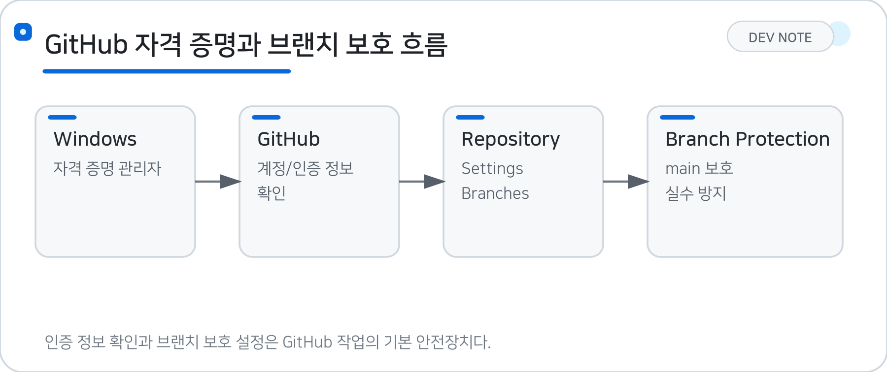
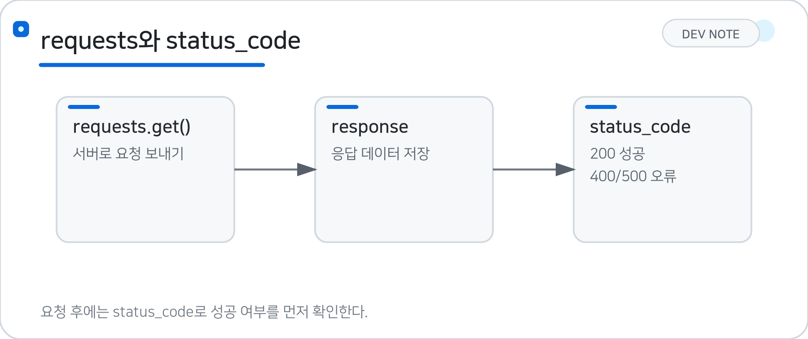
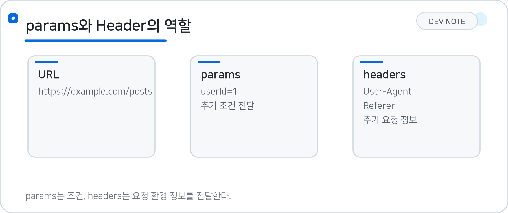

# 08/24 (월) · 12일차 — GitHub 설정과 웹 크롤링 기초

## 1. Windows GitHub 자격 증명

Windows에서는 GitHub 로그인 정보를 **자격 증명 관리자**에서 확인하거나 관리할 수 있다.

> **핵심:** GitHub 계정·인증 문제는 Windows 자격 증명 관리자에서 저장된 정보를 확인해 해결할 수 있다.

```text
제어판
  ↓
자격 증명 관리자
  ↓
Windows 자격 증명
  ↓
GitHub 관련 자격 증명
```

GitHub 계정이나 인증 정보 때문에 문제가 발생하는 경우 이곳에서 저장된 GitHub 자격 증명을 확인할 수 있다.

---

## 2. GitHub Repository 설정

GitHub에서 새로운 Repository를 생성한 후 Repository의 설정은 `Settings`에서 관리할 수 있다.

```text
Repository
  ↓
Settings
  ↓
Branches
```

### 2.1 Branch Protection Rule

**Branch Protection Rule**은 중요한 브랜치를 실수로 수정하거나 삭제하지 못하도록 보호하는 설정이다.

`Branch name pattern`에 보호할 브랜치 이름을 지정한다.

```text
Branch name pattern

main
```

즉, `main` 브랜치를 보호 대상으로 설정할 수 있다.

> **Branch Protection Rule = 중요한 브랜치를 안전하게 보호하는 규칙**

### 2.2 `dev` 브랜치 생성

실제 개발 과정에서는 `main` 브랜치에서 바로 작업하기보다 별도의 개발 브랜치를 만들어 사용할 수 있다.

```text
main
  ↓
dev
```

* `main` : 최종적으로 안정된 코드를 관리하는 브랜치
* `dev` : 개발 중인 코드를 합치고 테스트하는 브랜치

---

## 3. `requests`

> 📌 GitHub 자격 증명과 브랜치 보호 흐름 참고




`requests`는 Python에서 **웹 서버에 요청을 보내고 응답을 받을 때 사용하는 라이브러리**이다.

> **핵심:** requests.get()으로 서버에 요청을 보내면 서버에서 전달받은 결과가 response에 저장된다.

```python
import requests
```

기본적인 GET 요청은 다음과 같이 작성한다.

```python
response = requests.get(
    url="https://www.google.com/"
)
```

흐름은 다음과 같다.

```text
Python
  ↓ 요청
웹 서버
  ↓ 응답
response
```

`requests.get()`으로 서버에 요청을 보내면 서버에서 전달받은 결과가 `response`에 저장된다.

---

## 4. 응답 코드 `status_code`

웹 서버에 요청을 보낸 후 요청이 정상적으로 처리되었는지 **상태 코드(Status Code)**로 확인할 수 있다.

```python
response.status_code
```

예:

```text
200
```

대표적으로 다음과 같이 구분할 수 있다.

| 상태 코드   | 의미          |
| ------- | ----------- |
| `100`번대 | 요청 처리 중     |
| `200`번대 | 요청 성공       |
| `300`번대 | 다른 위치로 이동   |
| `400`번대 | 클라이언트 요청 오류 |
| `500`번대 | 서버 오류       |

따라서 실습에서는 다음과 같이 요청 성공 여부를 확인할 수 있다.

```python
if response.status_code < 400:
    print("성공")
```

> **`status_code` = 서버 요청 결과를 나타내는 상태 코드**



---

## 5. URL과 `params`

URL에서 `?` 뒤에 붙어 있는 값은 서버에 함께 전달되는 **Query Parameter(쿼리 파라미터)**이다.

예를 들어:

```text
https://example.com/posts?userId=1
```

구조를 나누면:

```text
https://example.com/posts
        ↑ URL

?userId=1
    ↑ Parameter
```

`requests`에서는 `?` 뒤의 내용을 직접 URL에 작성하지 않고 `params`로 분리해서 전달할 수 있다.

```python
response = requests.get(
    url="https://jsonplaceholder.typicode.com/posts",
    params={
        "userId": "1"
    }
)
```

즉,

```text
URL에 ?가 있다
        ↓
? 앞부분 → url
? 뒷부분 → params
```

> **`params` = URL과 함께 서버에 전달할 추가 조건**



---

## 6. `response.json()`

서버가 JSON 형식으로 데이터를 보내준 경우 `response.json()`을 사용하여 Python에서 사용할 수 있는 형태로 변환할 수 있다.

```python
response.json()
```

JSON 객체는 Python에서 주로 **딕셔너리와 리스트 형태**로 다룰 수 있다.

예를 들어 응답 데이터에서 `title`만 가져오려면:

```python
[
    jsn['title'] for jsn in response.json()
]
```

전체 데이터 중 필요한 값만 선택하여 사용할 수 있다.

---

## 7. HTTP Header

웹 서버에 요청을 보낼 때 URL뿐만 아니라 요청에 대한 추가 정보를 **Header**에 담아 전달할 수 있다.

```python
headers = {
    "User-Agent": "...",
}
```

그리고 `requests.get()`에 전달한다.

```python
response = requests.get(
    url=url,
    headers=headers
)
```

### 7.1 User-Agent

`User-Agent`는 사용자가 **어떤 환경이나 브라우저를 통해 접속했는지 알려주는 정보**이다.

```python
headers = {
    "User-Agent": "Mozilla/5.0 ..."
}
```

서버에서는 이 정보를 참고하여 사용자의 접속 환경에 맞는 데이터를 전달할 수 있다.

> **User-Agent = 어떤 브라우저·환경에서 요청했는지 알려주는 정보**

### 7.2 Referer

`Referer`는 현재 웹페이지를 요청하기 전에 **어떤 웹페이지에서 왔는지 알려주는 URL 정보**이다.

```python
headers = {
    "user-agent": "Mozilla/5.0 ...",
    "referer": "https://news.naver.com/"
}
```

예를 들어:

```text
네이버 뉴스
    ↓
IT/과학 뉴스
```

IT/과학 뉴스 페이지를 요청할 때 `Referer`에는 이전 페이지인 네이버 뉴스 주소가 들어갈 수 있다.

> **Referer = 현재 페이지에 오기 직전의 URL 정보**

---

## 8. 네이버 뉴스 HTML 가져오기

`requests`를 이용하여 웹페이지의 HTML 데이터를 가져올 수 있다.

```python
import requests

headers = {
    "user-agent": "Mozilla/5.0 ...",
    "referer": "https://news.naver.com/"
}

url = "https://news.naver.com/section/105"

response = requests.get(
    url=url,
    headers=headers
)
```

요청이 성공했는지 확인한다.

```python
response.status_code
```

그리고 서버에서 받은 HTML은 다음과 같이 확인할 수 있다.

```python
print(response.text)
```

> **`response.text` = 서버에서 전달받은 HTML 등의 문자열 데이터**

---

## 9. HTML 기본 구조

웹페이지는 HTML 태그를 이용하여 구조를 만든다.

예:

```html
<ul>
    <li>첫 번째</li>
    <li>두 번째</li>
</ul>
```

`ul`은 **Unordered List**의 약자로, 순서가 없는 목록을 만들 때 사용한다.

| 태그       | 의미                       |
| -------- | ------------------------ |
| `<ul>`   | Unordered List, 순서 없는 목록 |
| `<li>`   | List Item, 목록의 각 항목      |
| `<div>`  | 영역을 구분하는 태그              |
| `<p>`    | 문단                       |
| `<a>`    | 링크                       |
| `<span>` | 특정 부분을 묶는 태그             |

웹 크롤링에서는 이러한 HTML 구조를 확인하고 **필요한 태그나 데이터를 찾아서 추출**한다.

---

## 10. BeautifulSoup

`BeautifulSoup`은 HTML 문서를 분석해서 **원하는 데이터를 쉽게 찾을 수 있도록 도와주는 라이브러리**이다.

```python
from bs4 import BeautifulSoup as bs
```

가져온 HTML을 BeautifulSoup 객체로 변환한다.

```python
soup = bs(response.text, "html.parser")
```

각 부분의 의미는 다음과 같다.

```text
response.text
     ↓
웹페이지의 HTML 문자열
     ↓
BeautifulSoup
     ↓
HTML 구조 분석
     ↓
soup
```

`"html.parser"`는 HTML 문서를 분석하는 Parser이다.

> **BeautifulSoup = HTML에서 원하는 데이터를 찾기 쉽게 만들어주는 도구**

---

## 11. `select()`

`select()`를 사용하면 **CSS 선택자 방식으로 원하는 HTML 요소를 찾을 수 있다.**

> **핵심:** select()는 CSS 선택자로 HTML 요소를 찾으며, 결과는 여러 요소를 담을 수 있는 리스트 형태로 반환된다.

```python
newsct = soup.select("#newsct")
```

`#newsct`에서 `#`은 HTML의 `id`를 의미한다.

HTML이 다음과 같다면:

```html
<div id="newsct">
    ...
</div>
```

다음 코드로 해당 요소를 찾을 수 있다.

```python
soup.select("#newsct")
```

`select()`의 결과는 **여러 개의 요소를 담을 수 있는 리스트 형태**로 반환된다.

---

## 12. HTML에서 특정 데이터 추출

예를 들어 HTML이 다음과 같다고 가정한다.

```html
<div class="item-price">
    <div class="o-price">
        <span>27,000원</span>
    </div>

    <div class="s-price">
        <span>12,900원</span>
    </div>
</div>
```

먼저 원하는 영역을 선택한다.

```python
p_lst = soup.select("body > div")
```

그리고 특정 `div`를 찾을 수 있다.

```python
p_lst[0].find_all("div", class_="o-price")
```

텍스트만 가져오려면 `get_text()`를 사용한다.

```python
print(
    p_lst[0]
    .find_all("div", class_="o-price")[0]
    .get_text()
)
```

결과:

```text
27,000원
```

즉, 웹 크롤링의 기본 과정은 다음과 같다.

```text
웹페이지 요청
    ↓
HTML 가져오기
    ↓
BeautifulSoup으로 HTML 분석
    ↓
원하는 태그 찾기
    ↓
필요한 텍스트 추출
```

---

## 13. `find_all()`

`find_all()`은 조건에 해당하는 **HTML 요소를 모두 찾을 때 사용**한다.

```python
find_all("div", class_="o-price")
```

의미:

```text
div
 ↓
<div> 태그를 찾는다.

class_="o-price"
 ↓
class가 o-price인 요소를 찾는다.
```

`class`는 Python에서 사용하는 키워드이기 때문에 BeautifulSoup에서는 `class_`처럼 뒤에 `_`를 붙여 사용한다.

---

## 14. `get_text()`

`get_text()`는 HTML 태그를 제외하고 **안에 들어 있는 텍스트만 가져온다.**

```html
<span>27,000원</span>
```

여기에 `get_text()`를 사용하면:

```text
27,000원
```

만 가져올 수 있다.

> **`get_text()` = HTML 태그를 제외하고 텍스트만 추출**

---

## 15. 전체 흐름

```text
GitHub 자격 증명 및 브랜치 설정
      ↓
requests로 웹 서버에 요청 보내기
      ↓
status_code / params / headers 활용
      ↓
HTML 응답(response.text) 받기
      ↓
BeautifulSoup으로 HTML 구조 분석
      ↓
select() / find_all() / get_text()로 데이터 추출
```

---

## 🟦 핵심 정리

### 💡 주요 개념

| 개념                     | 의미                           |
| ---------------------- | ---------------------------- |
| 자격 증명 관리자              | Windows에 저장된 GitHub 인증 정보 관리 |
| Branch Protection Rule | 중요한 브랜치를 보호하는 규칙             |
| `main`                 | 안정된 최종 코드를 관리하는 브랜치          |
| `dev`                  | 개발 중인 코드를 통합하는 브랜치           |
| `requests`             | Python에서 웹 서버에 요청을 보내는 라이브러리 |
| `requests.get()`       | 서버에 GET 요청                   |
| `response`             | 서버가 보내준 응답                   |
| `status_code`          | 요청 성공·실패 상태 확인               |
| `params`               | URL에 전달하는 Query Parameter    |
| `response.json()`      | JSON 응답을 Python에서 사용할 수 있는 형태로 변환 |
| `response.text`        | 서버에서 받은 HTML 등의 문자열 데이터      |
| `headers`              | 서버에 요청과 함께 전달하는 추가 정보        |
| `User-Agent`           | 접속한 브라우저·환경 정보               |
| `Referer`              | 현재 페이지에 오기 직전의 URL 정보        |
| HTML                   | 웹페이지의 구조를 만드는 언어             |
| `<ul>`                 | 순서가 없는 목록                    |
| `<li>`                 | 목록의 각 항목                     |
| BeautifulSoup          | HTML을 분석하여 데이터를 추출하는 라이브러리  |
| `select()`             | CSS 선택자로 HTML 요소 검색          |
| `find_all()`           | 조건에 해당하는 HTML 요소 모두 검색       |
| `get_text()`           | HTML 태그를 제외하고 텍스트만 추출        |

### 💻 주요 코드

| 코드     | 의미  |
| ------ | --- |
| `requests.get(url=url, headers=headers)` | 웹 서버에 GET 요청을 보내면서 headers도 함께 전달 |
| `response.status_code` | 요청이 성공했는지 상태 코드로 확인 |
| `response.json()` | JSON 응답을 Python 딕셔너리·리스트 형태로 변환 |
| `response.text` | 응답받은 HTML 등 문자열 데이터 확인 |
| `soup = bs(response.text, "html.parser")` | HTML 문자열을 BeautifulSoup 객체로 변환 |
| `soup.select("#newsct")` | CSS 선택자(id)로 원하는 HTML 요소 찾기 |
| `find_all("div", class_="o-price")` | 조건(class)에 맞는 HTML 요소 모두 찾기 |
| `get_text()` | HTML 태그를 제외하고 텍스트만 추출 |

### ⭐ 오늘의 핵심

- **핵심 1:** GitHub은 Branch Protection Rule로 중요한 브랜치를 보호하고, main과 dev 브랜치를 분리해 운영할 수 있다.
- **핵심 2:** requests 라이브러리로 웹 서버에 요청을 보내고, status_code·params·headers를 통해 요청 과정을 확인하고 제어할 수 있다.
- **핵심 3:** BeautifulSoup의 select()와 find_all()로 HTML에서 원하는 요소를 찾고 get_text()로 텍스트를 추출하는 것이 웹 크롤링의 기본 과정이다.

### 🔖 복습할 내용

- [ ] Branch Protection Rule과 main/dev 브랜치 운영 방식
- [ ] User-Agent, Referer 등 HTTP Header의 역할과 필요성
- [ ] select()와 find_all()의 차이 및 CSS 선택자 활용법
