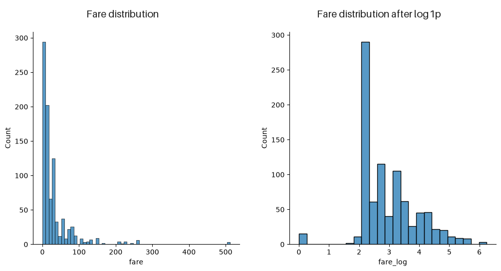
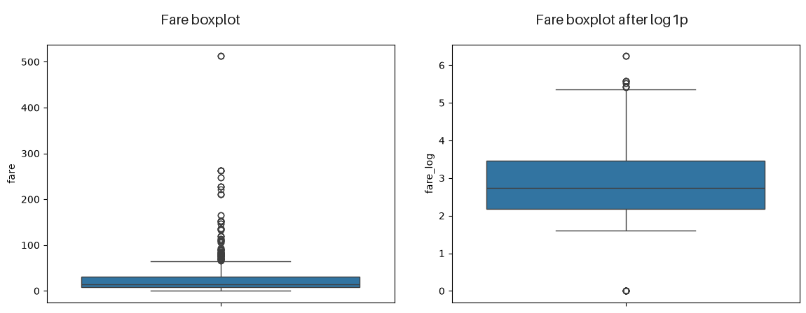
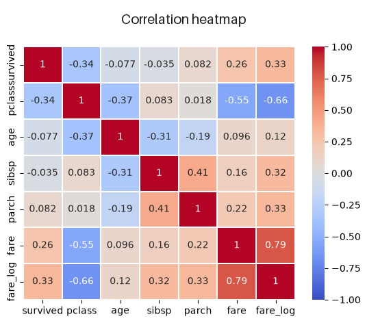
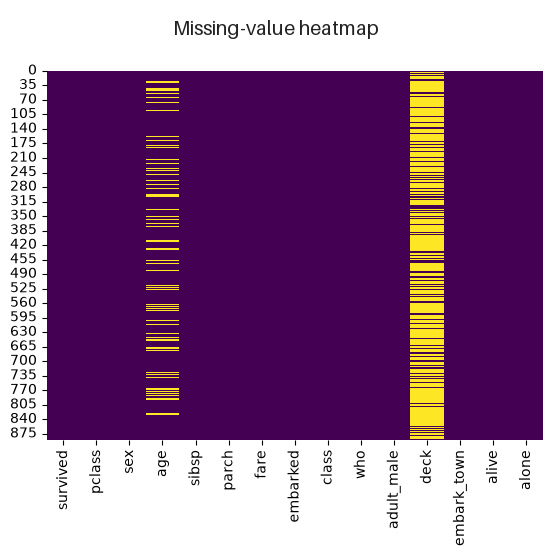

# 09/01 · 18일차 --- EDA와 데이터 전처리

## 🔁 이전 내용 복습

### DataFrame 확인과 그래프 선택

이전 수업에서 `shape`, `columns`, `info()`, `head()`, `tail()`로 DataFrame의 구조를 확인하고, 수치형 분포에는 Histogram, 범주별 비교에는 Bar Plot, 이상치 확인에는 Box Plot을 사용했다.

``` python
df.shape
df.columns
df.info()
df.head()
df.tail()
```

> **핵심:** 오늘은 데이터 구조를 확인한 뒤 자료형·분포·상관관계·결측치를 탐색하고 필요한 전처리를 수행한다.

------------------------------------------------------------------------

## 1. 데이터 유형과 EDA

### 1.1 저장 구조에 따른 분류

| 종류 | 의미 | 예시 |
| --- | --- | --- |
| 정형 데이터 | 행과 열처럼 일정한 구조를 가진 데이터 | Excel, 관계형 데이터베이스 |
| 반정형 데이터 | 일정한 표 구조는 아니지만 태그나 키로 구조를 표현 | XML, JSON |
| 비정형 데이터 | 정해진 행·열 구조가 없는 데이터 | 텍스트, 이미지 |

### 1.2 값의 의미에 따른 분류

| 큰 분류 | 세부 분류 | 의미 | 예시 |
| --- | --- | --- | --- |
| 수치형 | 연속형 | 소수점까지 연속적으로 측정할 수 있는 값 | 키, 몸무게, 요금 |
| 수치형 | 이산형 | 개수처럼 셀 수 있고 값이 끊어지는 값 | 형제 수, 승객 수 |
| 범주형 | 순서형 | 종류를 구분하면서 순서도 있는 값 | 객실 등급 |
| 범주형 | 명목형 | 종류만 있고 순서는 없는 값 | 성별, 혈액형 |

숫자로 저장되어 있어도 값의 의미가 종류를 구분한다면 범주형일 수 있다. Titanic의 `survived`는 `0`, `1`이지만 사망과 생존을 구분하므로 범주형으로 해석할 수 있다.

### 1.3 EDA

EDA(Exploratory Data Analysis)는 본격적인 분석이나 모델링 전에 데이터의 구조, 자료형, 분포, 결측치, 이상치, 변수 관계를 탐색하는 과정이다.

``` python
import numpy as np
import pandas as pd
import matplotlib.pyplot as plt
import seaborn as sns

df = sns.load_dataset("titanic")
```

실습 데이터의 Shape은 `(891, 15)`였다.

------------------------------------------------------------------------

## 2. DataFrame 구조와 기술통계 확인

### 2.1 기본 정보 확인

| 코드 | 의미 |
| --- | --- |
| `df.shape` | `(행 개수, 열 개수)` 확인 |
| `df.columns` | 컬럼 이름 확인 |
| `df.info()` | 컬럼별 non-null 개수와 dtype 확인 |
| `df.head()` | 앞의 5행 확인 |
| `df.tail()` | 뒤의 5행 확인 |

`shape`와 `columns`는 함수가 아닌 속성이므로 괄호 없이 사용한다.

### 2.2 자료형에 따른 컬럼 선택

``` python
df_number = df.select_dtypes(include=np.number)
df_not_number = df.select_dtypes(exclude=np.number)
```

- `include=np.number` → 저장 dtype이 숫자인 컬럼 선택
- `exclude=np.number` → 숫자가 아닌 컬럼 선택

`exclude=np.number`의 결과에는 문자열뿐 아니라 `category`, `bool`도 포함될 수 있다. 또한 저장 dtype과 데이터의 실제 의미가 다를 수 있으므로 자동 선택 결과를 그대로 확정하지 않는다.

### 2.3 `describe()` 해석

``` python
df_number.describe()
df_not_number.describe()
```

수치형 기술통계:

| 항목 | 의미 |
| --- | --- |
| `count` | 결측치를 제외한 개수 |
| `mean` | 평균 |
| `std` | 표준편차 |
| `min`, `max` | 최솟값, 최댓값 |
| `25%`, `50%`, `75%` | 사분위수 |

범주형 기술통계:

| 항목 | 의미 |
| --- | --- |
| `count` | 결측치를 제외한 개수 |
| `unique` | 서로 다른 값의 개수 |
| `top` | 최빈값 |
| `freq` | 최빈값이 나온 횟수 |

### 2.4 자료형 변경과 컬럼 삭제

``` python
df["pclass"] = df["pclass"].astype(str)
```

`astype()`은 자료형을 변경한다. 결측치가 있는 숫자 컬럼을 일반 `int`로 바로 변환하면 오류가 발생할 수 있으므로 먼저 결측치를 처리해야 한다.

``` python
df.drop(
    ["alive", "class", "embark_town"],
    axis=1,
    inplace=True,
)
```

- `axis=1` → 컬럼 방향으로 삭제
- `inplace=True` → 기존 DataFrame에 바로 반영

------------------------------------------------------------------------

## 3. 분포와 왜도·첨도

### 3.1 Histogram으로 분포 확인

``` python
sns.displot(data=df, x="age", bins=20)
```

`bins=20`은 수치 데이터를 20개 구간으로 나눠 빈도를 표시한다.

### 3.2 왜도

왜도(skewness)는 분포가 좌우로 얼마나 비대칭인지 나타내며, **꼬리가 긴 방향**에 따라 부호를 붙인다.

| 왜도 | 분포 모양 |
| ---: | --- |
| `0`에 가까움 | 비교적 대칭 |
| `0`보다 큼 | 오른쪽 꼬리가 김 |
| `0`보다 작음 | 왼쪽 꼬리가 김 |

``` python
df["age"].skew()
```

실행 결과:

``` text
0.38910778230082704
```

`age`는 비교적 대칭이지만 오른쪽 꼬리가 약간 더 길다. `-0.5~0.5`를 대칭에 가까운 범위로 보기도 하지만 절대적인 기준은 아니다.

> **오류 수정:** 실습 주석에는 양수와 음수 왜도의 방향이 반대로 적혀 있었다. 양의 왜도는 오른쪽 꼬리, 음의 왜도는 왼쪽 꼬리가 긴 분포이다.

### 3.3 첨도

첨도(kurtosis)는 분포의 꼬리 두께와 극단값이 나타나는 정도를 보여준다.

``` python
df["fare"].kurt()
```

Pandas의 `kurt()`는 일반적인 Pearson 첨도에서 3을 뺀 **초과첨도**를 반환한다.

| Pandas `kurt()` | 의미 |
| ---: | --- |
| `0`에 가까움 | 정규분포와 비슷한 초과첨도 |
| `0`보다 큼 | 꼬리가 두껍고 극단값이 나타나기 쉬움 |
| `0`보다 작음 | 꼬리가 얇고 비교적 완만함 |

> **오류 수정:** 일반적인 Pearson 첨도에서 정규분포의 기준은 `3`이지만 Pandas `kurt()`의 기준은 `0`이다.

### 3.4 로그 변환

오른쪽 꼬리가 긴 양수 데이터는 로그 변환으로 큰 값의 영향과 치우침을 줄일 수 있다.

``` python
df["fare_log"] = np.log1p(df["fare"])

df["fare_log"].skew()
df["fare"].kurt()
df["fare_log"].kurt()
```

실행 결과:

``` text
fare_log 왜도: 0.3949280095189306
fare 첨도: 33.39814088089868
fare_log 첨도: 0.976142106683104
```



위 그래프처럼 로그 변환 전후의 분포를 비교하면 큰 값의 영향과 오른쪽 치우침이 줄어든 정도를 확인할 수 있다.

`np.log1p(x)`는 $\log(1+x)$를 계산하므로 값에 `0`이 있어도 사용할 수 있다.

> **주의:** 로그 변환이 제곱근 변환보다 항상 좋은 것은 아니며, 정규분포가 모든 모델에 반드시 필요한 것도 아니다. 데이터와 모델의 결과를 확인해 변환 여부를 정한다.

------------------------------------------------------------------------

## 4. 이상치와 Box Plot

``` python
sns.boxplot(data=df, y="fare")
sns.boxplot(data=df, y="fare_log")
```



로그 변환 전후의 Box Plot을 비교하면 값의 범위와 극단값이 어떻게 달라지는지 시각적으로 확인할 수 있다.

| 구성 | 의미 |
| --- | --- |
| 박스 아래 | 제1사분위수 `Q1`, 25% 지점 |
| 박스 안의 선 | 중앙값 `Q2`, 50% 지점 |
| 박스 위 | 제3사분위수 `Q3`, 75% 지점 |
| 박스 | `Q1~Q3`의 가운데 50% 범위 |
| 수염 | 일반적으로 `1.5 × IQR` 안의 데이터 범위 |
| 수염 밖의 점 | 잠재적인 이상치 |

수염 밖의 점이 무조건 잘못된 데이터라는 뜻은 아니다. 데이터의 의미를 확인한 뒤 처리 여부를 결정한다.

------------------------------------------------------------------------

## 5. 범주형 분석과 상관관계

### 5.1 범주별 비교와 교차표

``` python
sns.catplot(
    data=df,
    x="sex",
    y="survived",
    hue="pclass",
    kind="bar",
)
```

- `x` → 범주형 기준
- `y` → 비교할 수치형 값
- `hue` → 추가 그룹
- `kind` → 그래프 종류

막대 위의 세로선은 추정값의 불확실성을 나타내는 오차막대이다.

``` python
df.groupby(["sex", "pclass"])["survived"].mean()

pd.crosstab(
    df["sex"],
    df["survived"],
    normalize="index",
)
```

`normalize="index"`는 각 행을 기준으로 비율을 계산한다.

### 5.2 상관계수와 Heatmap

상관계수 $r$은 두 수치형 변수의 선형 관계 방향과 강도를 나타낸다.

$-1 \le r \le 1$

| 상관계수 | 의미 |
| ---: | --- |
| `1`에 가까움 | 강한 양의 선형관계 |
| `0`에 가까움 | 선형관계가 약함 |
| `-1`에 가까움 | 강한 음의 선형관계 |

상관계수에는 단위가 없다. `r=0`이어도 비선형 관계는 있을 수 있고, 상관관계가 있다고 인과관계가 성립하는 것은 아니다.

``` python
corr = df.select_dtypes(include=np.number).corr()

sns.heatmap(
    data=corr,
    vmin=-1,
    vmax=1,
    annot=True,
    linewidths=0.2,
    cmap="coolwarm",
)
```



Heatmap에서는 색과 숫자를 함께 보면서 변수 사이의 양의 상관관계와 음의 상관관계의 방향과 강도를 비교할 수 있다.

`annot=True`는 Heatmap 각 칸에 상관계수를 표시한다. 숫자로 저장된 범주형 컬럼은 숫자 코드의 의미를 고려해 해석한다.

------------------------------------------------------------------------

## 6. 결측치 확인

결측치는 값이 비어 있거나 관측되지 않은 상태이다. 숫자 `0`은 실제 값이므로 결측치가 아니다.

### 6.1 결측치 표현

| 표현 | 의미 |
| --- | --- |
| `Null` | 값이 존재하지 않는 상태를 뜻하는 일반 표현 |
| `undefined` | 주로 JavaScript에서 값이 정의되지 않은 상태 |
| `NaN` | Pandas 수치형 데이터에서 자주 보는 결측 표현 |
| `None`, `pd.NA` | Pandas가 결측치로 처리할 수 있는 값 |

### 6.2 결측치 개수와 비율

``` python
df.isnull()
df.isnull().sum()
df.isnull().sum().sum()
```

`isnull()`은 결측치면 `True`, 아니면 `False`를 반환한다. 합계에서 `True=1`, `False=0`으로 계산되므로 결측치 개수를 구할 수 있다.

실습 결과:

``` text
age            177
embarked         2
deck           688
embark_town      2
전체 결측치     869
```

``` python
missing_ratio = (
    df.isnull().sum() / df.shape[0]
).sort_values(ascending=False)
```

Titanic의 `deck` 결측 비율은 약 `0.772166`, `age`는 약 `0.198653`이었다. 궁금한 항목이 위에 오도록 정렬하면 분석하기 쉽다.

``` python
df_isnull = df.isnull().sum()
cond = df_isnull > 0
null_cols = df_isnull[cond].index.tolist()
```

실행 결과:

``` text
['age', 'embarked', 'deck', 'embark_town']
```

### 6.3 결측치 시각화와 발생 방식

``` python
sns.heatmap(df.isnull(), cbar=False, cmap="viridis")
```



결측치 Heatmap을 이용하면 어떤 컬럼에 결측치가 집중되어 있는지와 결측 위치의 패턴을 한눈에 확인할 수 있다.

Heatmap은 결측치의 위치와 패턴을 보여준다. 정확한 개수와 비율은 숫자로 다시 확인한다.

| 종류 | 의미 |
| --- | --- |
| MCAR | 다른 값과 관계없이 완전히 우연히 발생 |
| MAR | 관측된 다른 Feature와 관련되어 발생 |
| MNAR | 결측된 값 자체나 관측되지 않은 요인과 관련되어 발생 |

------------------------------------------------------------------------

## 7. 결측치 처리

Data Cleaning은 오류, 중복, 결측치, 부적절한 자료형 등을 찾아 정리하는 과정이다.

### 7.1 삭제 여부 결정

- 결측치가 있는 행 또는 컬럼 삭제
- 평균·중앙값·최빈값으로 대체
- 기존 값에서 무작위 표본을 추출해 대체

결측 비율만으로 고정된 처리 규칙을 적용하지 않는다. 데이터 양, 컬럼의 중요도, 결측 원인을 함께 고려한다. 실습에서는 결측치가 약 77.2%인 `deck` 컬럼을 제거했다.

``` python
df.drop(["deck"], axis=1, inplace=True)
```

### 7.2 평균과 중앙값 대체

``` python
df["age_mean"] = df["age"].fillna(df["age"].mean())
df["age_median"] = df["age"].fillna(df["age"].median())
```

평균은 이상치의 영향을 받기 쉽고 중앙값은 비교적 안정적이다. 그러나 많은 결측치를 하나의 값으로 채우면 해당 값에 데이터가 몰려 분포가 왜곡될 수 있다.

``` python
fig, ax = plt.subplots(figsize=(10, 6))

df["age"].plot(kind="kde", ax=ax, color="blue")
df["age_median"].plot(kind="kde", ax=ax, color="red")
df["age_mean"].plot(kind="kde", ax=ax, color="green")

plt.show()
```

### 7.3 최빈값 대체

``` python
embarked_mode = df["embarked"].mode().values[0]
df["embarked"] = df["embarked"].fillna(embarked_mode)
```

`mode()`는 최빈값을 Series로 반환하고 `values[0]`은 첫 번째 최빈값을 선택한다.

### 7.4 무작위 표본 대체와 인덱스 정렬 문제

``` python
random_sampling = df["age"].dropna().sample(
    n=df["age"].isnull().sum(),
    random_state=42,
)

df["age_random"] = df["age"].copy()

df.loc[df["age_random"].isnull(), "age_random"] = (
    random_sampling.to_numpy()
)
```

- `dropna()` → 결측치 제외
- `sample()` → 무작위 표본 추출
- `loc` → 조건과 컬럼 이름으로 위치 선택
- `to_numpy()` → 인덱스를 제외한 값만 사용

노트북에서 `random_sampling` Series를 그대로 대입했을 때 Pandas가 인덱스를 맞춰 대입하여 `age_random`에 177개의 결측치가 그대로 남았다. 값의 순서대로 채우려면 `to_numpy()`로 인덱스를 제거한다.

무작위 표본 대체는 원래 분포를 덜 왜곡할 수 있지만 다른 변수와의 관계까지 보존하는 것은 아니다. 처리 후에는 결측치 개수와 분포를 다시 확인한다.

------------------------------------------------------------------------

## 8. 데이터 누수

데이터 누수(Data Leakage)는 실제 예측 시점에는 알 수 없는 정보가 모델 학습에 들어가는 문제이다.

``` text
Train 데이터 → 전처리 기준 학습
Test 데이터  → Train에서 학습한 기준으로 transform만 수행
```

Test 데이터를 사용해 전처리 기준이나 모델을 학습시키면 평가 결과가 실제보다 좋아질 수 있다. 학습은 Train 데이터로만 수행하고 Test 데이터에는 학습된 변환을 적용한다.

------------------------------------------------------------------------

## 전체 흐름

``` text
정형·반정형·비정형 데이터 구분
  ↓
수치형·범주형과 세부 유형 확인
  ↓
shape·columns·info로 구조 확인
  ↓
select_dtypes·describe로 기술통계 확인
  ↓
Histogram·왜도·첨도·Box Plot로 분포 탐색
  ↓
범주별 비교와 상관관계 확인
  ↓
결측치 개수·비율·패턴·발생 원인 확인
  ↓
삭제 또는 적절한 값으로 대체
  ↓
결측치와 분포 재확인
  ↓
Train 기준으로 학습해 데이터 누수 방지
```

------------------------------------------------------------------------

## 🟦 핵심 정리

### 💡 주요 개념

| 개념 | 의미 |
| --- | --- |
| 정형·반정형·비정형 | 저장 구조에 따른 데이터 분류 |
| 연속형·이산형 | 수치형 데이터의 세부 종류 |
| 순서형·명목형 | 범주형 데이터의 세부 종류 |
| EDA | 데이터 구조·분포·결측치·관계를 탐색하는 과정 |
| 왜도 | 분포의 비대칭 정도 |
| 초과첨도 | 정규분포의 첨도 3을 뺀 값 |
| 이상치 | 다른 관측값과 크게 떨어진 잠재적 특이값 |
| 상관관계 | 두 변수의 선형 관계 방향과 강도 |
| 결측치 | 값이 없거나 관측되지 않은 상태 |
| Data Cleaning | 오류·중복·결측치·자료형 등을 정리하는 과정 |
| 데이터 누수 | 예측 시점에 알 수 없는 정보가 학습에 사용되는 문제 |

### 💻 주요 코드

| 코드 | 의미 |
| --- | --- |
| `df.select_dtypes()` | dtype 기준으로 컬럼 선택 |
| `df.describe()` | 자료형에 맞는 기술통계 확인 |
| `df.astype()` | 자료형 변경 |
| `df.drop(..., axis=1)` | 컬럼 삭제 |
| `df["col"].skew()` | 왜도 계산 |
| `df["col"].kurt()` | Pandas 초과첨도 계산 |
| `np.log1p()` | $\log(1+x)$ 로그 변환 |
| `df.corr()` | 상관계수 계산 |
| `pd.crosstab()` | 범주형 변수 교차표 생성 |
| `df.isnull().sum()` | 컬럼별 결측치 개수 계산 |
| `df.fillna()` | 결측치 대체 |
| `df.dropna()` | 결측치 제거 |
| `series.sample()` | 무작위 표본 추출 |

### ⭐ 오늘의 핵심

- **데이터 유형:** 저장 dtype뿐 아니라 값의 실제 의미를 기준으로 수치형·범주형을 판단한다.
- **분포 해석:** 왜도는 꼬리가 긴 방향으로 부호를 정하며 Pandas `kurt()`는 정규분포 기준이 0인 초과첨도이다.
- **결측치 처리:** 개수·비율·발생 원인을 확인한 뒤 삭제나 대체 방법을 고르고 결과를 다시 검증한다.
- **누수 방지:** 전처리와 모델의 학습 기준은 Train 데이터에서 만들고 Test에는 변환만 적용한다.

### 🔖 복습할 내용

- [ ] 연속형·이산형·순서형·명목형 구분하기
- [ ] 왜도 부호와 Pandas 초과첨도 해석하기
- [ ] Box Plot의 Q1·중앙값·Q3·IQR 확인하기
- [ ] 결측치 개수와 비율을 내림차순으로 확인하기
- [ ] 평균·중앙값·최빈값·무작위 표본 대체 비교하기
- [ ] Train과 Test를 분리해 데이터 누수를 막는 이유 설명하기
